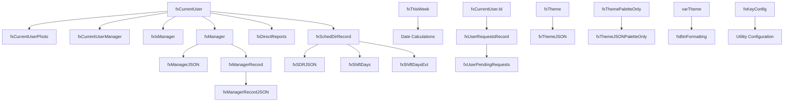

# Formulas Relationships

This diagram shows the main relationships between the different elements in your formulas:

1. User Profile Information:
   - fxCurrentUser is the central object, feeding into several other user-related formulas.
   - It's used to derive manager information, direct reports, and scheduling directory records.

2. Manager Information:
   - fxManager is derived from fxCurrentUser and is used to create JSON representations and records.

3. Scheduling Information:
   - fxSchedDirRecord is used to create JSON representations and derive shift information.

4. Date and Time:
   - fxThisWeek is an independent calculation for the current week's dates.

5. User Requests:
   - fxUserRequestsRecord and fxUserPendingRequests are derived from the current user's ID.

6. Theme and Styling:
   - fxTheme and fxThemePaletteOnly are used to create JSON representations of the theme.
   - varTheme (which isn't explicitly defined in the provided code but is referenced) is used to create button formatting rules.

7. Utility:
   - fxKeyConfig stands alone as a utility configuration.
